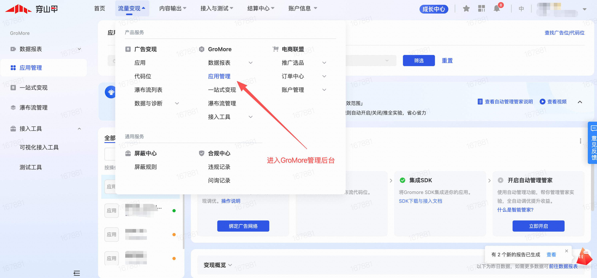
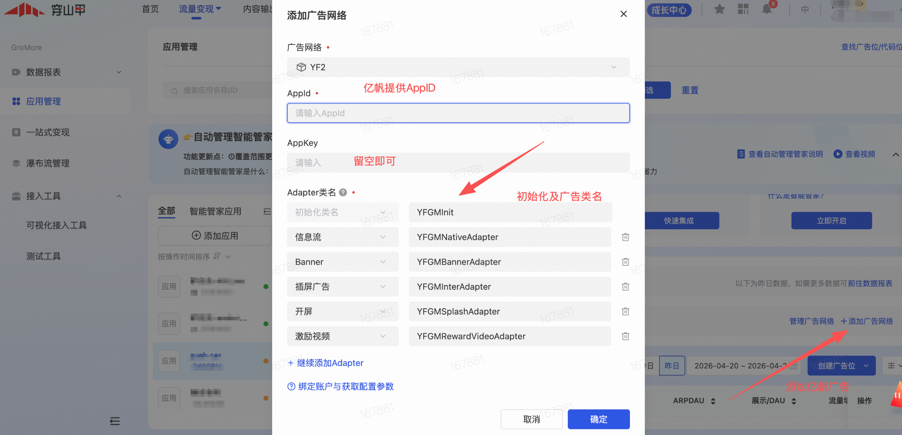
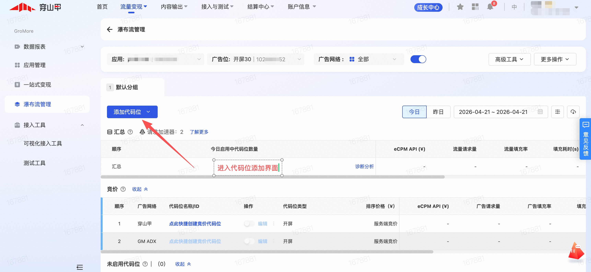
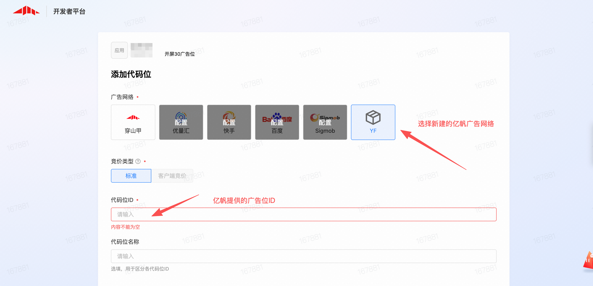

### 1. GroMore 自定义接入

#### 1.1 参考文档

- GroMore 自定义广告网络文档：<https://www.csjplatform.com/supportcenter/5878>
- GroMore 自定义广告网络基类说明（iOS）：<https://www.csjplatform.com/union/media/union/download/detail?id=162&docId=27738&locale=zh-CN&osType=ios>
- GroMore亿帆适配器Demo：https://github.com/com-yifan/ios-gromore-yf-adapter
- 亿帆SDK对接文档：https://github.com/com-yifan/ios-yf-sdk

#### 1.2 接入说明

当媒体通过 GroMore 平台接入亿帆广告能力，且采用"自定义 ADN / 自定义广告网络"方案时，可参考本节进行配置。

接入前建议先确认：

- 当前账号已开通 GroMore 自定义 ADN 功能（GroMore目前已面向所有穿山甲开发者开放，开发者无需申请，可在穿山甲平台看到【GroMore】入口）
- 已获取亿帆平台分配的 `AppID`
- 已获取亿帆平台分配的广告位 ID
- 已确认各广告类型对应的 Adapter 类名

#### 1.3 iOS 集成方式

```ruby
# GroMoreSDK 
pod 'Ads-CN', '7.4.0.4', :subspecs => ['BUAdSDK','CSJMediation','BUAdLive-Framework']
# GroMore 亿帆适配器
pod 'GMYFAdapter'
# 亿帆SDK 部分适配器导入可参考亿帆对接文档3.2章节
pod 'YFAdsSDK', '6.1.0.0'
#  百度【必须】
pod 'BaiduMobAdSDK','10.032'
# 优量汇【必须】
pod 'GDTMobSDK' ,'4.15.75'
# 京东【必须】
pod 'JADYun', '2.6.8'
pod 'JADYunMotion', '2.6.8'  #京东摇一摇组件
# 穿山甲【必须】⚠️注意：旧版本有 按照2.3-1方式集成 的，需要去掉 TTSDKFramework
pod 'Ads-CN', '7.4.0.4', :subspecs => ['BUAdSDK','CSJMediation','BUAdLive-Framework']
# Gromore-Adn适配器
pod 'GMBaiduAdapter', '10.02.1'
pod 'GMGdtAdapter', '4.15.65.0'
pod 'GMKsAdapter', '4.11.20.1.0'
# 快手【必须】
pod 'KSAdSDK','5.1.20.1'
# 微信OpenSDK【必须】，如App内已通过其他方式集成OpenSDK，无需再次集成
pod 'WechatOpenSDK-XCFramework'
```

#### 1.4 平台配置说明

在 GroMore 后台创建自定义广告网络时，需要填写不同广告类型对应的 iOS Adapter 类名。

```text
初始化：YFGMInit
开屏：YFGMSplashAdapter
激励视频：YFGMRewardVideoAdapter
Banner：YFGMBannerAdapter
插屏：YFGMInterAdapter
信息流：YFGMNativeAdapter
```

#### 1.5 广告源配置说明

在 GroMore 聚合管理中新增广告源时，建议按如下规则填写：

- `AppID`：填写亿帆平台分配的 `AppID`
- `Placement ID / 广告位 ID`：填写亿帆平台分配的广告位 ID
- `自定义广告网络`：选择已创建的亿帆自定义平台
- `Adapter 类名`：根据广告类型填写对应 iOS Adapter 类名

#### 1.6 信息流广告说明

目前亿帆适配器SDK仅支持模板渲染

#### 1.7 配置截图说明

- GroMore管理入口：GroMore目前已面向所有穿山甲开发者开放，开发者无需申请，可在穿山甲平台看到【GroMore】入口



- 添加亿帆广告网络并补充亿帆AppID，各广告类型适配器类名及初始化类名



- 添加亿帆广告位ID





#### 1.8 注意事项

1. 建议在添加广告网络和添加广告源后，分别核对一次 `AppID`、广告位 ID 和 Adapter 类名。
2. 如平台字段名称与本文档不完全一致，请以平台当前页面实际字段为准。
